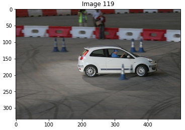
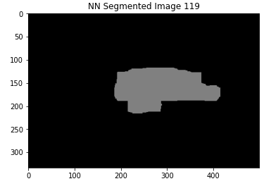
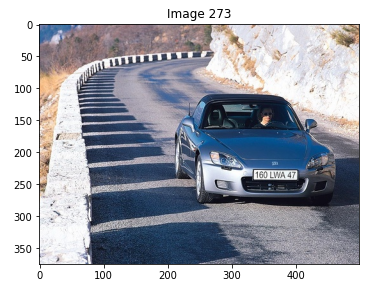

## Project 1: Lane Lines Image Detection w/ OpenCV

The goal of this project was to use Python and OpenCV to create an image processing pipeline to detect the lane lines in a video taken from a car travelling along a road. The pipeline I created has the following steps:


1. Convert RGB image to grayscale
2. Apply Gaussian filter to image
3. Use Canny Edge detection to find strong lines within image
4. Apply a Region of Interest Mask in order to just look at the lane lines
5. Hough Transform the image to create two continuous lines, one for each lane line
6. Draw the detected lane lines over top of the original image

The following GIF shows the output of the lane line detection pipeline:
      


## Project 2: Semantic Segmentation via Deep Neural Net (DNN)

The goal of this project was to create a DNN with PyTorch which would be able produce a semantic segmentation model which achieves a mean Intersection over Union (mIOU) score of >40%.

Semantic Segmentation is the task of catergorizing each pixel in some input image into a specifc class, and for this project specifially, the classes were people, and cars.
Some example input, and corresponding output images can be seen below.

| Original Image  | Semantic Segmentation Output|
| :-------------: |:---------------------------:|
|  | |
|  | |
|  | |

In the first and second outputs, the car has been correctly classified. In the third output image, the people riding the bikes have been correctly identified.

## Project 3: Probabilistic Occupancy Grid Generation from LiDAR Data

In this project, I was given LiDAR sensor readings, with which I converted into a Probabilistic Occupancy Grid. This involved converting the data from spherical coordinates, to a Cartesian coordinate space, creating a logodds occupancy grid, and then converting said grid into the Probabilistic Occupancy Grid. 

<p align="center">
  
</p>

<center>This image is a visual representation of the LiDAR Scanner (black) with a point cloud of its readings (red)</center> 

You can use the [editor on GitHub](https://github.com/moward98/moward98.github.io/edit/main/README.md) to maintain and preview the content for your website in Markdown files.

Whenever you commit to this repository, GitHub Pages will run [Jekyll](https://jekyllrb.com/) to rebuild the pages in your site, from the content in your Markdown files.

### Markdown

Markdown is a lightweight and easy-to-use syntax for styling your writing. It includes conventions for

```markdown
Syntax highlighted code block

# Header 1
## Header 2
### Header 3

- Bulleted
- List

1. Numbered
2. List

**Bold** and _Italic_ and `Code` text

[Link](url) and 
```

For more details see [GitHub Flavored Markdown](https://guides.github.com/features/mastering-markdown/).

### Jekyll Themes

Your Pages site will use the layout and styles from the Jekyll theme you have selected in your [repository settings](https://github.com/moward98/moward98.github.io/settings/pages). The name of this theme is saved in the Jekyll `_config.yml` configuration file.

### Support or Contact

Having trouble with Pages? Check out our [documentation](https://docs.github.com/categories/github-pages-basics/) or [contact support](https://support.github.com/contact) and we’ll help you sort it out.
